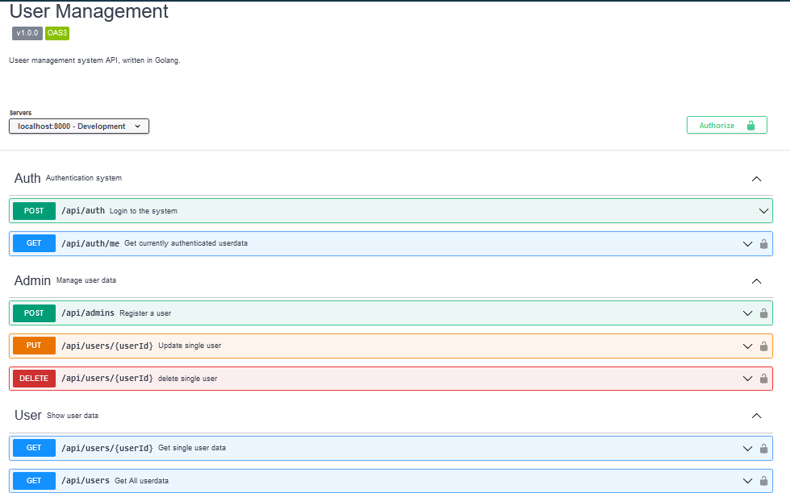
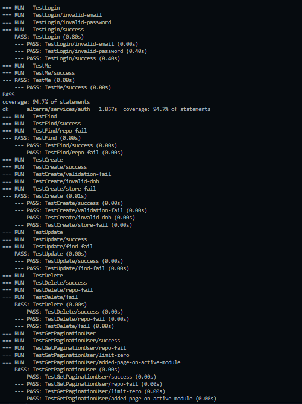

# Alterra-Assignment-Test

Simple API project using echo framework

[](https://www.codacy.com/gh/mnasruls/Alterra-Assignment-Test/dashboard?utm_source=github.com&amp;utm_medium=referral&amp;utm_content=mnasruls/Alterra-Assignment-Test&amp;utm_campaign=Badge_Grade)
[](https://www.codacy.com/gh/mnasruls/Alterra-Assignment-Test/dashboard?utm_source=github.com&utm_medium=referral&utm_content=mnasruls/Alterra-Assignment-Test&utm_campaign=Badge_Coverage)


## About The Project

Project ini adalah sebuah aplikasi untuk manajemen user dimana terdapat dua entitas yaitu user dan admin. Adapun admin bisa melakukan manajemen user berupa create, update dan delete akun user. User dan admin dapat melihat profile diri, melihat profile user lain dan semua data user.

Berikut fitur yang terdapat dalam Bringeee :

- Fitur Admin
    - Login
    - Create user
    - Edit user
    - Delete user
    - Get profile
    - Get profile user lain
    - Get all user
- Fitur User
    - Login
    - Get profile
    - Get profile user lain
    - Get all user

## Tech Stack

&nbsp;
&nbsp;
&nbsp;
&nbsp;
&nbsp;
&nbsp;
&nbsp;
&nbsp;
&nbsp;

## Link Documentation (Open API)
https://app.swaggerhub.com/apis-docs/nasrulmuhammad63/user-management/v1.0.0


<p align="right">(<a href="#top">back to top</a>)</p>

## Getting Started

Kloning project
```bash
  https://github.com/mnasruls/Alterra-Assignment-Test.git
```
atau
```bash
 git@github.com:mnasruls/Alterra-Assignment-Test.git
``
Masuk ke direktori project

```bash
  $ cd ~/[nama project]
```
Buat sebuah file dengan nama di dalam folder root project `.env` dengan format `.env.example` yang ada di repository. Sesuaikan configurasi di komputer lokal.

Jalankan aplikasi 

```bash
  $ go run .
```

Pertama - tama buatlah sebuah akun admin terlebih dahulu secara manual di database. Sebagai contoh:
- name = admin
- email = admin@gmail.com
- password = $2a$04$4DN4YtzdEpuWEX83brLiju39dXHnEnWUmafYvnBoMrTJwOQuOFrbu 👈🏻 (Input ke database) -- masukkan 123 untuk login
- dob = 2000-08-07 07:00:00.000
- gender = laki - laki
- address = Jl. jend. sudirman
- phone number = 081222333444
- role = admin

Setelah membuat akun admin secara manual, silahkan mencoba fitur - fitur lainnya.

## How To Run Unit Test

Jalankan di terminal dengan perintah

```bash
 ./test.sh
```
Hasil testing


<p align="right">(<a href="#top">back to top</a>)</p>
